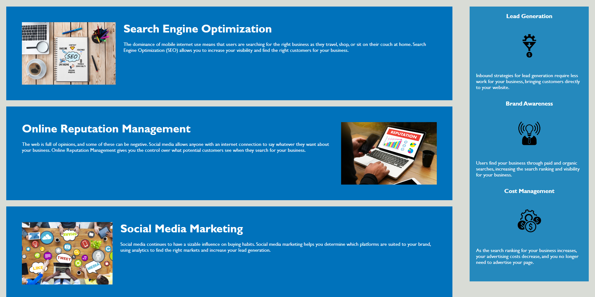

# Challenge-1

## This repository was deisgned to develop a full funcitioning website that captures the company Horiseon and what information they provide such as search engine optimization, Online reputation Management, and Social-media-marketing

## Desciription: 

 The motivation :
behind this repository / project was to challenege users to fix the code in the index.html by adding HTML5 semantics to the code and making everything more organized. When it comes to the Stlye.css we have adjusted redundancy in the multiple class sections and contensed them into a better grouping. For this project we wanted to keep the webpage develop as close to the main webpage and keep its integrity and having all the functions stay the same. 

 The purpose
The project was completed to esnure that developers have good professional practice in making sure the code in index.html has good semantics all throughout the code and proper classifications with proper class assigning. When it comes to Style.css we have the ability to remove redundancy in code and make sure everything works in order. 

 Problem: 
The problem we have solved is removing certain classes specified for multiple attributes. We have also solved a lot of the semantics in the index.html.. Instead of using /div for all the sections we added header, body, main, section, article etc. Some of the problems I personally faced throughout the challenge was understanding different linguistics when it comes to HTML. After exhausting some resources and asking for help, I was able to finally implement article into my html code and understand its purpose. When working around in style.CSS i found out what can work by simplifying and what would not necessarily work and ruin the integrity of the webpage. 

Throughout this acitvity i was able to learn how to properly format html code from scratch and seeing how it builds a webpage. When fixing style.css I noticed that there was a lot of classes broken down to 3 different classes with separate specifications ( such as : .benefits-cost{ } / benefits-brand { }) that all have the same function. We were able to condense them into one section and still have the same webpage functionality. 

##  Usage

## Credits

As collaborators for this project, we have Christopher Joo and Columbia University Bootcamp for the starter code

